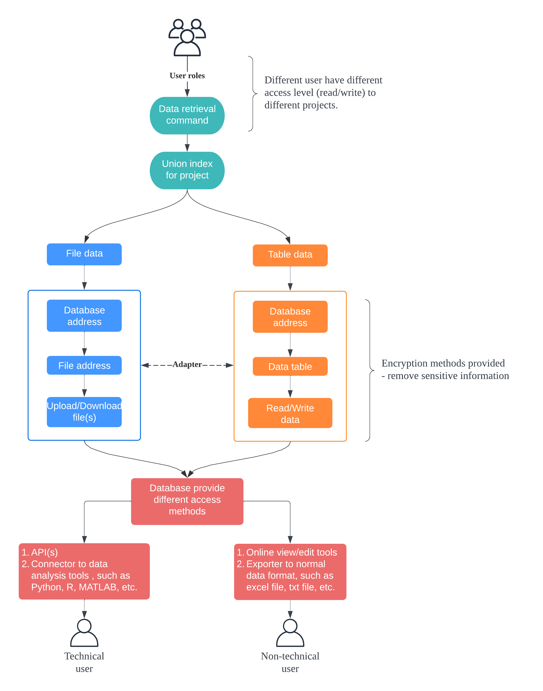

# Promotion Plan of Research Data Management at CUHK
1.	Choose proper database for different type of research data.\
There are mainly 2 types of data: table data and file data. Choose different database to fit different types of data but apply the same project index system.

2.	Build adapter for different database.\
Make data join easier between different database with same or similar features. For example, clinical notes and medical images for patients with same ID.

3.	Non-technical and technical research data access method.\
Provide different access method for researchers with different background to reduce the learning costs.

4.	Security and encryption.\
Set up different access rights for each user. At the same time, provide methods to encrypt the sensitive information, such as HKID, phone no, etc.

